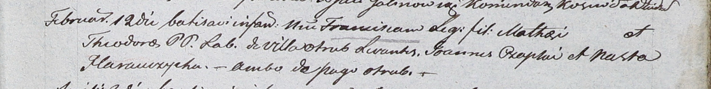

**Стрельчёнок Франциск Мацеев (Stralczonek Francisc)**

12 февраля 1804 г -- крещение (НИАБ 937-4-32, лист 10, №4/1804-р).

**НИАБ 937-4-32:** Лист 10. **Метрическая запись №4/1804-р.**

{width="6.496527777777778in"
height="0.8243055555555555in"}

Дедиловичский костел Наисвятейшего Сердца Иисуса. 12 февраля 1804 года.
Метрическая запись о крещении.

\[Stralczonek\] Francisc -- сын крестьян с деревни Отруб.

\[Stralczonek\] Mathei -- отец.

\[Stralczonkowa\] Theodora -- мать.

Czaplay Joann -- крестный отец, с деревни Отруб.

Harauczycha Nasta -- крестная мать, с деревни Отруб.

Galinowski Joann -- ксёндз, комендант Дедиловичского костела.
