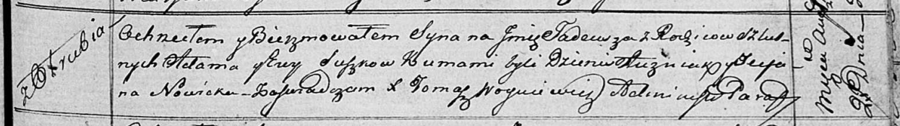
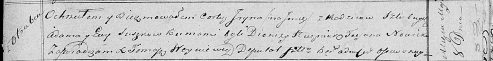
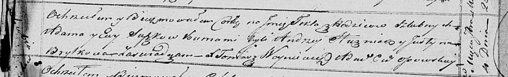

**Сушко Ева (Suszkowa Ewa)**

27 августа 1816 г -- крещение сына Тадея (НИАБ 136-13-894, лист 94,
№27/1816-р (об)).

8 мая 1819 г -- крещение дочери Ирыны (НИАБ 136-13-894, лист 101,
№24/1819-р (об)).

28 августа 1821 г -- крещение дочери Текли (НИАБ 136-13-894, лист 107,
№42/1821-р (об)).

**НИАБ 136-13-894:** Лист 94. **Метрическая запись №27/1816-р (ориг).**

Осовская Покровская церковь. 27 августа 1816 года. Метрическая запись о
крещении.

Suszko Tadeusz -- сын родителей с деревни Отруб.

Suszko Adam -- отец.

Suszkowa Ewa -- мать.

Huzniak Dzienis -- кум.

Nowicka Tecjana -- кума.

Woyniewicz Tomasz -- ксёндз.

**НИАБ 136-13-894:** Лист 101. **Метрическая запись №24/1819-р (ориг).**

Осовская Покровская церковь. 8 мая 1819 года. Метрическая запись о
крещении.

Suszkowna Jryna -- дочь родителей с деревни Отруб.

Suszko Adam -- отец.

Suszkowa Ewa -- мать.

Huzniak Dionizy -- кум.

Nowicka Taciana -- кума.

Woyniewicz Tomasz -- ксёндз.

**НИАБ 136-13-894:** Лист 107. **Метрическая запись №42/1821-р (ориг).**

Осовская Покровская церковь. 28 августа 1821 года. Метрическая запись о
крещении.

Suszkowna Tekla -- дочь родителей с деревни Отруб.

Suszko Adam -- отец.

Suszkowa Ewa -- мать.

Huzniak Andrzey -- кум.

Brytkowa Justyna -- кума.

Woyniewicz Tomasz -- ксёндз.
