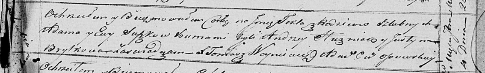

**Сушко Текля Адамова (Suszkowna Tekla)**

28 августа 1821 г -- крещение (НИАБ 136-13-894, лист 107, №42/1821-р
(об)).

**НИАБ 136-13-894:** Лист 107. **Метрическая запись №42/1821-р (ориг).**

Осовская Покровская церковь. 28 августа 1821 года. Метрическая запись о
крещении.

Suszkowna Tekla -- дочь родителей с деревни Отруб.

Suszko Adam -- отец.

Suszkowa Ewa -- мать.

Huzniak Andrzey -- кум.

Brytkowa Justyna -- кума.

Woyniewicz Tomasz -- ксёндз.
