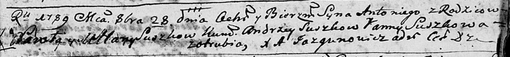

**Сушко Павел (Suszko Paweł)**

28 октября 1789 г -- крещение сына Антона (НИАБ 136-13-894, лист 8,
№56/1789-р (ориг)).

**НИАБ 136-13-894:** Лист 8. **Метрическая запись №56/1789-р (ориг).**

{width="6.496527777777778in"
height="0.7308508311461067in"}

Дедиловичская Покровская церковь. 28 октября 1789 года. Метрическая
запись о крещении.

Suszko Antonij -- сын родителей с деревни Отруб.

Suszko Paweł -- отец.

Suszkowa Ullana -- мать.

Suszko Andrzey - кум.

Suszkowa Anna - кума.

Jazgunowicz Antoni -- ксёндз.
