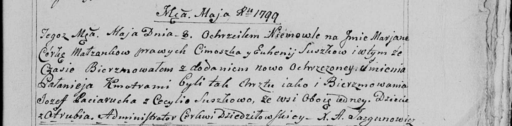

**Сушко Марьяна Цимошкова (Suszkowna Marjana Pałanieja)**

8 мая 1799 г -- крещение (НИАБ 136-13-894, лист 39, №20/1799-р (ориг)),
(РГИА 823-2-18, лист 270, №20/1799-р (коп), НИАБ 136-13-938, лист 242,
№19/1799-р (коп)).

**НИАБ 136-13-894:** Лист 39. **Метрическая запись №20/1799-р (ориг).**

{width="6.496527777777778in"
height="0.8072889326334208in"}

Дедиловичская Покровская церковь. 8 мая 1799 года. Метрическая запись о
крещении.

Suszkowna Marjana Pałanieja -- дочь родителей с деревни Отруб.

Suszko Cimoszka -- отец.

Suszkowa Euhenija -- мать.

Paciarucha Jozef-- кум.

Suszkowa Cecylia -- кума.

Jazgunowicz Antoni -- ксёндз.

**РГИА 823-2-18:** Лист 270. **Метрическая запись №20/1799-р (коп).**

{width="6.496527777777778in"
height="2.8930555555555557in"}

Дедиловичская Покровская церковь. 8 мая 1799 года. Метрическая запись о
крещении.

Suszkowna Marjana -- дочь родителей с деревни Отруб.

Suszko Cimoszka -- отец.

Suszkowa Euhenija -- мать.

Paciarucha Jozef -- кум.

Suszkowa Cecylia -- кума.

Jazgunowicz Antoni -- ксёндз.

**НИАБ 136-13-938:** Лист 242. **Метрическая запись №19/1799-р (коп).**

(См. тж. НИАБ 136-13-894, лист 39, №20/1799-р (ориг); РГИА 823-2-18,
лист 269, №20/1799-р (коп))

{width="6.496527777777778in"
height="1.601388888888889in"}

Дедиловичская Покровская церковь. 8 мая 1799 года. Метрическая запись о
крещении.

Suszkowna Marjana Pałaneja -- дочь родителей с деревни Отруб.

Suszko Cimoszka -- отец.

Suszkowna Euhenija -- мать.

Paciarucha Jozef -- кум, с деревни Отруб.

Suszkowa Cecylia - кума, с деревни Отруб.

Jazgunowicz Antoni -- ксёндз.
