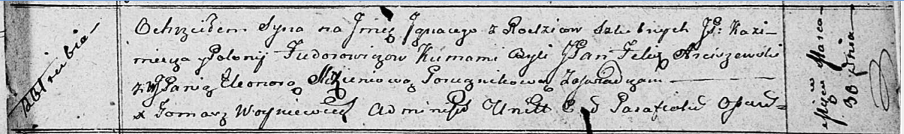

**Федорович Казимир, шляхтич (Fiedorowicz Kazimierz)**

30 марта 1812 г -- крещение сына Игнацыя (НИАБ 136-13-894, лист 84,
№22/1812-р (ориг)).

**НИАБ 136-13-894:** Лист 84. **Метрическая запись №22/1812-р (ориг).**

Осовская Покровская церковь. 30 марта 1812 года. Метрическая запись о
крещении.

Fiedorowicz Jgnacy, JP -- сын родителей с деревни Отруб, шляхтич.

Fiedorowicz Kazimerz, JP -- отец, шляхтич.

Fiedorowiczowa Polonija, JP -- мать, шляхтянка.

Arciszewski Felix, JP -- кум, шляхтич.

Slizieniowa? Eleonora, WJP -- кума, шляхтянка.

Woyniewicz Tomasz -- ксёндз.
