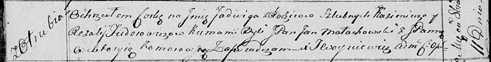

**Федорович Ядвига Казимирова, шляхтянка (Fiedorowiczowna Jadwiga)**

11 октября 1814 г -- крещение (НИАБ 136-13-894, лист 90об, №56/1814-р
(ориг)).

**НИАБ 136-13-894:** Лист 90об. **Метрическая запись №56/1814-р
(ориг).**

{width="6.496527777777778in"
height="0.8347790901137357in"}

Осовская Покровская церковь. 11 октября 1814 года. Метрическая запись о
крещении.

Fiedorowiczowna Jadwiga -- дочь родителей с деревни Отруб.

Fiedorowicz Kazimerz -- отец.

Fiedorowiczowa Rozalija -- мать.

Małachowski Jan, JP -- кум, шляхтич.

Komarowska Wiktoryja, JP -- кума, шляхтянка.

Woyniewicz Tomasz -- ксёндз.
