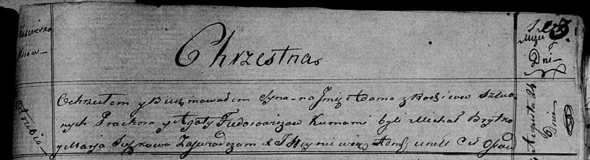

**Федорович Адам Прохоров (Fiedorowicz Adam)**

24 августа 1819 г -- крещение (НИАБ 136-13-894, лист 103, №50/1819-р
(ориг)).

**НИАБ 136-13-894:** Лист 103. **Метрическая запись №50/1819-р (ориг).**

{width="6.496527777777778in"
height="1.7701345144356955in"}

Осовская Покровская церковь. 24 августа 1819 года. Метрическая запись о
крещении.

Fiedorowicz Adam -- сын родителей с деревни Отруб.

Fiedorowicz Prochor -- отец.

Fiedorowiczowa Agata -- мать.

Brytko Michał -- кум.

Suszkowa Marja -- кума.

Woyniewicz Tomasz -- ксёндз.
