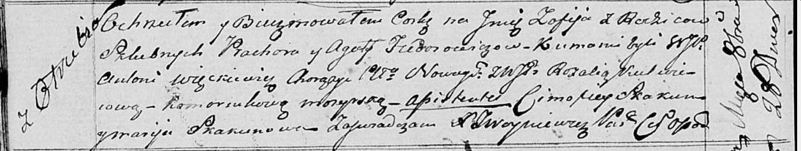

**Федорович София Прохорова (Fiedorowiczowna Zofija)**

28 октября 1817 г -- крещение (НИАБ 136-13-894, лист 97об, №63/1817-р
(ориг)).

**НИАБ 136-13-894:** Лист 97об. **Метрическая запись №63/1817-р
(ориг).**

{width="6.496527777777778in"
height="1.2303772965879265in"}

Осовская Покровская церковь. 28 октября 1817 года. Метрическая запись о
крещении.

Fiedorowiczowna Zofija -- дочь родителей с деревни Отруб.

Fiedorowicz Prochor -- отец.

Fiedorowiczowa Agata -- мать.

Więckiewicz Antoni, WJP -- кум, шляхтич.

Kulwiecowa Rozalia, WJP -- кума,шляхтянка.

Skakun Cimofiey -- ассистент.

Skakunowa Marija -- ассистентка.

Woyniewicz Tomasz -- ксёндз.
