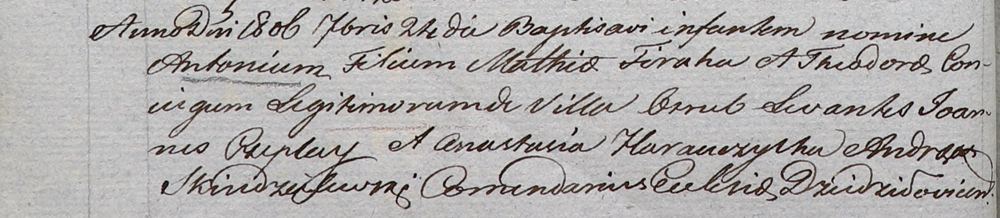

**Фираго Тодора (Firahowa Theodora)**

24 сентября 1806 г -- крещение сына Антона (НИАБ 937-4-32, лист 13об,
№19/1806-р).

**НИАБ 937-4-32:** Лист 13об. **Метрическая запись №19/1806-р.**

Дедиловичский костел Наисвятейшего Сердца Иисуса. 24 сентября 1806 года.
Метрическая запись о крещении.

Firaha Antoni -- сын родителей с деревни Отруб.

Firaha Mathias -- отец.

Firahowa Theodora -- мать.

Czeplay Joann -- крестный отец.

Harauczycha Anastasia -- крестная мать.

Skindzelewski Andreas -- ксёндз, комендант Дедиловичский.
