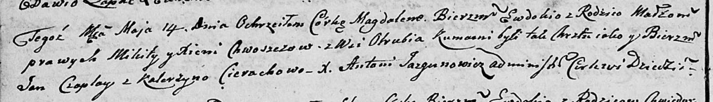

**Хвошч Микита (Chwoszcz Mikita)**

14 мая 1805 г -- крещение дочери Магдалены Евдокии (НИАБ 136-13-894,
лист 57об, №26/1805-р (ориг)).

**НИАБ 136-13-894:** Лист 57об. **Метрическая запись №26/1805-р
(ориг).**

Дедиловичская Покровская церковь. 14 мая 1805 года. Метрическая запись о
крещении.

Chwoszczowna Magdalena Ewdokija -- дочь родителей с деревни Отруб.

Chwoszcz Mikita -- отец.

Chwoszczowa Xienia -- мать.

Czaplay Jan -- кум.

Cierachowa Katerzyna -- кума.

Jazgunowicz Antoni -- ксёндз.
