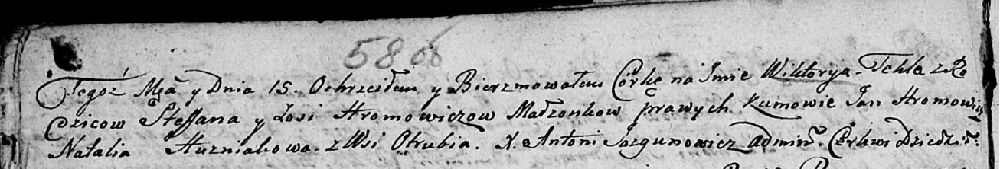

**Хромович Викторыя Стефанова (Hromowicz Stefan)**

15 октября 1805 г -- крещение (НИАБ 136-13-894, лист 58, №47/1805-р
(ориг)).

**НИАБ 136-13-894:** Лист 58. **Метрическая запись №47/1805-р (ориг).**

Дедиловичская Покровская церковь. 15 октября 1805 года. Метрическая
запись о крещении.

Hromowiczowna Wiktoryja Tekla -- дочь родителей с деревни Отруб.

Hromowicz Stefan -- отец.

Hromowiczowa Zosia -- мать.

Hromowicz Jan -- кум.

Huzniakowa Natalia -- кума.

Jazgunowicz Antoni -- ксёндз.
