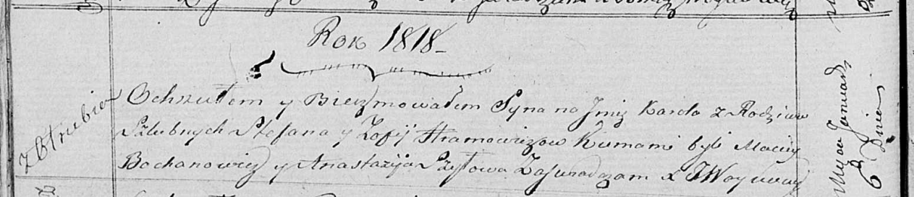

**Хромович Зося, София (Hromowiczowa, Hramowiczowa Zosia, Zofija)**

15 октября 1805 г -- крещение дочери Викторыи Текли (НИАБ 136-13-894,
лист 58, №47/1805-р (ориг)).

6 января 1818 г -- крещение сына Кароля (НИАБ 136-13-894, лист 97об,
№1/1818-р (ориг)).

**НИАБ 136-13-894:** Лист 58. **Метрическая запись №47/1805-р (ориг).**

{width="6.496527777777778in"
height="1.104323053368329in"}

Дедиловичская Покровская церковь. 15 октября 1805 года. Метрическая
запись о крещении.

Hromowiczowna Wiktoryja Tekla -- дочь родителей с деревни Отруб.

Hromowicz Stefan -- отец.

Hromowiczowa Zosia -- мать.

Hromowicz Jan -- кум.

Huzniakowa Natalia -- кума.

Jazgunowicz Antoni -- ксёндз.

**НИАБ 136-13-894:** Лист 97об. **Метрическая запись №1/1818-р (ориг).**

{width="6.496527777777778in"
height="1.404038713910761in"}

Осовская Покровская церковь. 6 января 1818 года. Метрическая запись о
крещении.

Hramowicz Karol -- сын родителей с деревни Отруб.

Hramowicz Stefan -- отец.

Hramowiczowa Zofija -- мать.

Bochanowicz Maciey -- кум.

Szyłowa Anastazija -- кума.

Woyniewicz Tomasz -- ксёндз.
