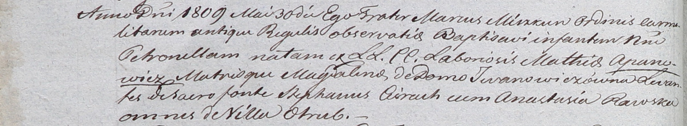

**Церах Катерина (Cierachowa Katerzyna)**

20 июня 1792 г -- крещение дочери Агриппины (НИАБ 136-13-894, лист 16,
№35/1792-р (ориг)).

**НИАБ 136-13-894:** Лист 16. **Метрическая запись №35/1792-р (ориг).**

{width="6.496527777777778in"
height="1.0238615485564304in"}

Дедиловичская Покровская церковь. 20 июня 1792 года. Метрическая запись
о крещении.

Cierachowna Rypina -- дочь родителей с деревни Отруб.

Cierach ? -- отец.

Cierachowa Katerzyna -- мать.

Słapkowski Lazar - кум.

Jurkiewiczowa Elżbieta - кума.

Jazgunowicz Antoni -- ксёндз.
