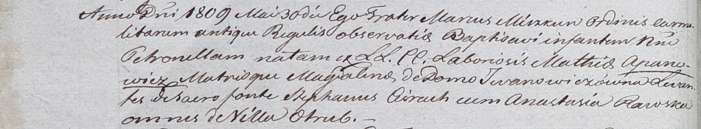

**Церах Стефан (Cierech Stephan)**

15 июня 1802 г -- крестный отец Миколая, сына Василя и Дарьи Шапелевичей
с деревни Отруб (НИАБ 937-4-32, лист 6об, №14/1802-р).

30 мая 1809 г -- крестный отец Петронели, дочери Матея и Магдалены
Апановичей с деревни Отруб (НИАБ 937-4-32, лист 19об, №13/1809-р).

**НИАБ 937-4-32:** Лист 6об. **Метрическая запись №14/1802-р.**

Дедиловичский костел Наисвятейшего Сердца Иисуса. 15 июня 1802 года.
Метрическая запись о крещении.

Szepelewicz Mikołay -- сын крестьян с деревни Отруб.

Szepelewicz Basili -- отец.

Szepelewiczowa Daria -- мать.

Cierech Stephan -- крестный отец, крестьянин, с деревни Отруб.

Kaminska Agatha -- крестная мать, крестьянин, с деревни Отруб.

Linhart Hyacinthus -- ксёндз.

**НИАБ 937-4-32:** Лист 19об. **Метрическая запись №13/1809-р.**

Дедиловичский костел Наисвятейшего Сердца Иисуса. 30 мая 1809 года.
Метрическая запись о крещении.

Apanowiczowna Petronilla -- дочь крестьян с деревни Отруб.

Apanowicz Mathias -- отец.

Apanowiczowa Magdalena z Jwanowiczow -- мать.

Cierach Stephan -- крестный отец, с деревни Отруб.

Rawska Anastasia -- крестная мать, с деревни Отруб.

Miszkun Marcus -- ксёндз.
