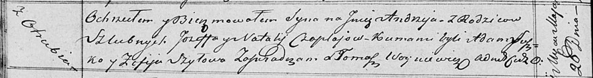

**Чапляй Андрей Иосифов (Czaplay Andrzey)**

26 мая 1818 г -- крещение (НИАБ 136-13-894, лист 98об, №17/1818-р
(ориг)).

**НИАБ 136-13-894:** Лист 98об. **Метрическая запись №17/1818-р
(ориг).**

{width="6.496527777777778in"
height="0.8642814960629921in"}

Осовская Покровская церковь. 26 мая 1818 года. Метрическая запись о
крещени.

Czaplay Andrzey -- сын родителей с деревни Отруб.

Czaplay Jozef -- отец.

Czaplaiowa Natalla -- мать.

Suszko Adam -- кум.

Szyłowa Zofija -- кума.

Woyniewicz Tomasz -- ксёндз.
