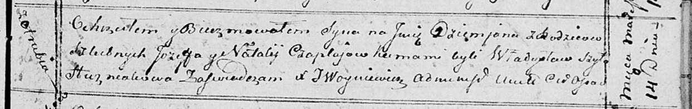

**Чапляй Демьян Иосифов (Czaplay Dziemjan)**

14 марта 1815 г -- крещение (НИАБ 136-13-894, лист 92, №14/1815-р
(ориг)).

**НИАБ 136-13-894:** Лист 92. **Метрическая запись №14/1815-р (ориг).**

Осовская Покровская церковь. 14 марта 1815 года. Метрическая запись о
крещении.

Czaplay Dziemjan -- дочь родителей с деревни Отруб.

Czaplay Jozef -- отец.

Czaplajowa Natalia -- мать.

Szyło Władysław -- кум.

Huzniakowa -- кума.

Woyniewicz Tomasz -- ксёндз.
