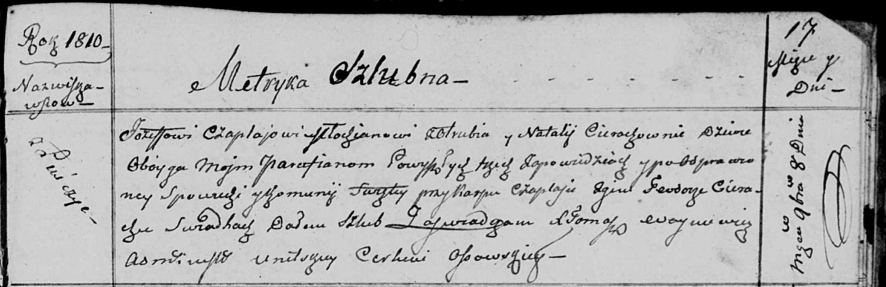
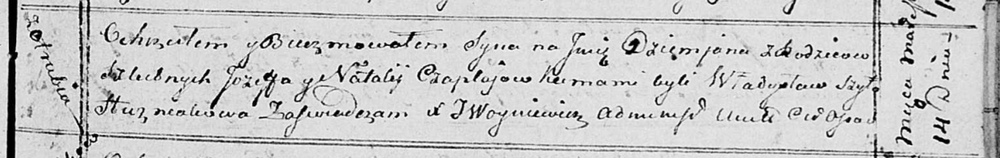
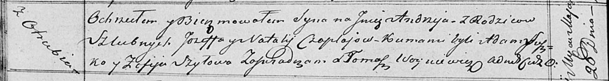

**Чапляй Иосиф (Czaplay Jozef)**

8 ноября 1810 г -- венчание с девкой Натальей Церах с деревни Лустичи
(НИАБ 136-13-920, лист 17, №7/1809-б (ориг)).

14 марта 1815 г -- крещение сына Демьяна (НИАБ 136-13-894, лист 92,
№14/1815-р (ориг)).

26 мая 1818 г -- крещение сына Андрея (НИАБ 136-13-894, лист 98об,
№17/1818-р (ориг)).

**НИАБ 136-13-920:** Лист 17. **Метрическая запись №7/1810-б (ориг).**

Осовская Покровская церковь. 8 ноября 1810 года. Метрическая запись о
венчании.

Czaplay Jozef -- жених, молодой, парафии Осовской, с деревни Отруб.

Cierachowna Natalla -- невеста, девка, парафии Осовской, с деревни
Лустичи.

Czaplay Karp -- свидетель.

Cierach Teodor -- свидетель.

Woyniewicz Tomasz -- ксёндз.

**НИАБ 136-13-894:** Лист 92. **Метрическая запись №14/1815-р (ориг).**

Осовская Покровская церковь. 14 марта 1815 года. Метрическая запись о
крещении.

Czaplay Dziemjan -- дочь родителей с деревни Отруб.

Czaplay Jozef -- отец.

Czaplajowa Natalia -- мать.

Szyło Władysław -- кум.

Huzniakowa -- кума.

Woyniewicz Tomasz -- ксёндз.

**НИАБ 136-13-894:** Лист 98об. **Метрическая запись №17/1818-р
(ориг).**

Осовская Покровская церковь. 26 мая 1818 года. Метрическая запись о
крещени.

Czaplay Andrzey -- сын родителей с деревни Отруб.

Czaplay Jozef -- отец.

Czaplaiowa Natalla -- мать.

Suszko Adam -- кум.

Szyłowa Zofija -- кума.

Woyniewicz Tomasz -- ксёндз.
