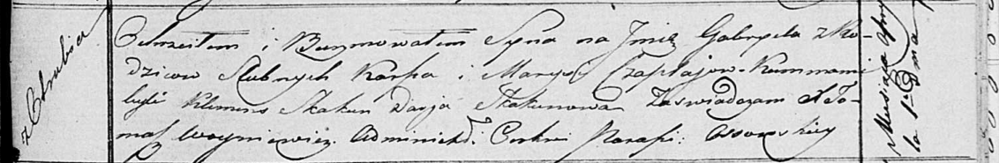

**Чапляй Габриэль Карпов (Czaplay Gabriel)**

1 апреля 1817 г -- крещение (НИАБ 136-13-894, лист 96, №23/1817-р
(ориг)).

**НИАБ 136-13-894:** Лист 96. **Метрическая запись №23/1817-р (ориг).**

{width="6.496527777777778in"
height="1.0614096675415574in"}

Осовская Покровская церковь. 1 апреля 1817 года. Метрическая запись о
крещении.

Czaplay Gabriel -- сын родителей с деревни Отруб.

Czaplay Karp -- отец.

Czaplaiowa Marysia -- мать.

Skakun Klemens -- кум.

Skakunowa Darja -- кума.

Woyniewicz Tomasz -- ксёндз.
