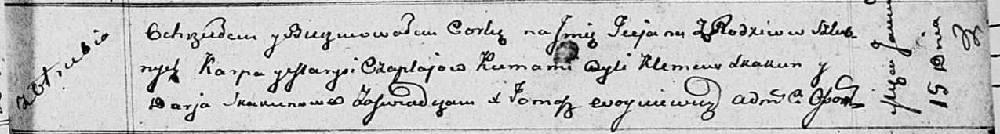

**Чапляй Карп (Czaplay Karp)**

23 сентября 1807 г -- крестный отец Паланеи, дочери Синяков Демида и
Анны с деревни Клинники (НИАБ 136-13-894, лист 63об, №40/1807-р (ориг)).

13 мая 1809 г -- крестный отец Антона, сына Дмитрия и Анны Синяков с
деревни Отруб (НИАБ 937-4-32, лист 19об, №16/1809-р).

15 января 1812 г -- крещение дочери Татьяны (НИАБ 136-13-894, лист 83,
№5/1812-р (ориг)).

21 декабря 1813 г -- крещение дочери Юстыны (НИАБ 136-13-894, лист 88,
№44/1813-р (ориг)).

1 апреля 1817 г -- крещение сына Габриэля (НИАБ 136-13-894, лист 96,
№23/1817-р (ориг)).

25 июля 1820 г -- крещение дочери Магдалены (НИАБ 136-13-894, лист
104об, №25/1820-р (ориг)).

**НИАБ 136-13-894:** Лист 63об. **Метрическая запись №40/1807-р
(ориг).**

{width="6.496527777777778in"
height="1.082866360454943in"}

Дедиловичская Покровская церковь. 23 сентября 1807 года. Метрическая
запись о крещении.

Siniakowna Pałanieja -- дочь родителей с деревни Клинники.

Siniak Dziamid -- отец.

Siniakowa Anna -- мать.

Czaplay Karp -- кум, с деревни Отруб.

Huzniakowa Parasia -- кума, с деревни Отруб.

Jazgunowicz Antoni -- ксёндз.

**НИАБ 937-4-32:** Лист 19об. **Метрическая запись №16/1809-р.**

{width="6.496527777777778in"
height="1.1708333333333334in"}

Дедиловичский костел Наисвятейшего Сердца Иисуса. 13 мая 1809 года.
Метрическая запись о крещении.

Siniak Antoni -- сын крестьян с деревни Отруб.

Siniak Dimitri -- отец.

Siniakowa Anna z Tresianków -- мать.

Czaplai Karp -- крестный отец, с деревни Отруб.

Szepelewiczowa Praxeda -- крестная мать, с деревни Отруб.

Miszkun Marcus -- ксёндз.

**НИАБ 136-13-894:** Лист 83. **Метрическая запись №5/1812-р (ориг).**

{width="6.496527777777778in"
height="0.8709864391951007in"}

Осовская Покровская церковь. 15 января 1812 года. Метрическая запись о
крещении.

Czaplajowna Taciana -- дочь родителей с деревни Отруб.

Czaplay Karp -- отец.

Czaplajowa Maryja -- мать.

Skakun Klemens -- кум.

Skakunowa Darja -- кума.

Woyniewicz Tomasz -- ксёндз.

**НИАБ 136-13-894:** Лист 88. **Метрическая запись №44/1813-р (ориг).**

{width="6.496527777777778in"
height="0.9648578302712161in"}

Осовская Покровская церковь. 21 декабря 1813 года. Метрическая запись о
крещении.

Czaplaiowna Justyna -- дочь родителей с деревни Отруб.

Czaplay Karp -- отец.

Czaplaiowa Marjana -- мать.

Skakun Klemens -- кум.

Suszkowa Darja -- кума.

Woyniewicz Tomasz -- ксёндз.

**НИАБ 136-13-894:** Лист 96. **Метрическая запись №23/1817-р (ориг).**

{width="6.496527777777778in"
height="1.0614096675415574in"}

Осовская Покровская церковь. 1 апреля 1817 года. Метрическая запись о
крещении.

Czaplay Gabriel -- сын родителей с деревни Отруб.

Czaplay Karp -- отец.

Czaplaiowa Marysia -- мать.

Skakun Klemens -- кум.

Skakunowa Darja -- кума.

Woyniewicz Tomasz -- ксёндз.

**НИАБ 136-13-894:** Лист 104об. **Метрическая запись №25/1820-р
(ориг).**

{width="6.496527777777778in"
height="0.7342038495188101in"}

Осовская Покровская церковь. 25 июля 1820 года. Метрическая запись о
крещении.

Czaplaiowa Magdalena -- дочь родителей с деревни Отруб.

Czaplay Karp -- отец.

Czaplaiowa Marjana -- мать.

Skakun Klemens -- кум.

Suszkowa Darija -- кума.

Woyniewicz Tomasz -- ксёндз.
