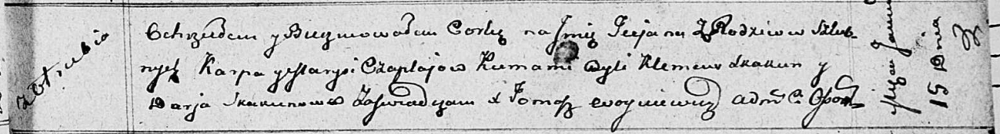

**Чапляй Татьяна Карпова (Czaplajowna Taciana)**

15 января 1812 г -- крещение (НИАБ 136-13-894, лист 83, №5/1812-р
(ориг)).

**НИАБ 136-13-894:** Лист 83. **Метрическая запись №5/1812-р (ориг).**

Осовская Покровская церковь. 15 января 1812 года. Метрическая запись о
крещении.

Czaplajowna Taciana -- дочь родителей с деревни Отруб.

Czaplay Karp -- отец.

Czaplajowa Maryja -- мать.

Skakun Klemens -- кум.

Skakunowa Darja -- кума.

Woyniewicz Tomasz -- ксёндз.
