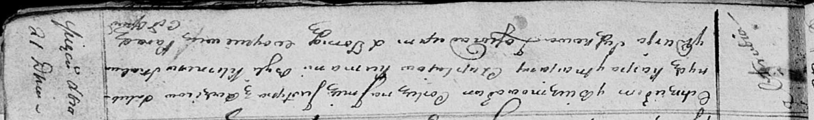

**Чапляй Юстына Карпова (Czaplajowna Justyna)**

21 декабря 1813 г -- крещение (НИАБ 136-13-894, лист 88, №44/1813-р
(ориг)).

**НИАБ 136-13-894:** Лист 88. **Метрическая запись №44/1813-р (ориг).**

Осовская Покровская церковь. 21 декабря 1813 года. Метрическая запись о
крещении.

Czaplaiowna Justyna -- дочь родителей с деревни Отруб.

Czaplay Karp -- отец.

Czaplaiowa Marjana -- мать.

Skakun Klemens -- кум.

Suszkowa Darja -- кума.

Woyniewicz Tomasz -- ксёндз.
