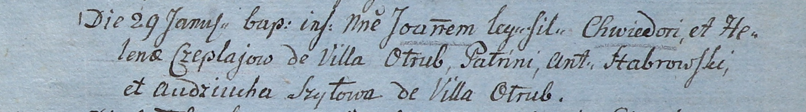

**Чапляй (Молчун) Елена (Czaplajowa Elena z Mauczunow)**

11 ноября 1796 г -- венчание с Хведором Чапляем с деревни Отруб (НИАБ
136-13-920, лист 3об, №15/1796-б (ориг)).

19 сентября 1802 г -- крестная мать Мартина, сына Рубочков Николая и
Елизабеты с деревни Отруб (НИАБ 937-4-32, лист 7об, №31/1802-р).

29 января 1805 г -- крещение сына Иоанна (НИАБ 937-4-32, лист 11,
№5/1805-р).

22 октября 1805 г -- крестная мать Томаша, сына Иосифа и Параси
Апановичей с деревни Отруб (НИАБ 937-4-32, лист 12об, №38/1805-р).

28 июля 1808 г -- крестная мать Якуба, сына Петра и Марцеллы Карпичей с
деревни Отруб (НИАБ 937-4-32, лист 18об, №21/1808-р).

**НИАБ 136-13-920:** Лист 3об. **Метрическая запись №15/1796-б (ориг).**

{width="6.496527777777778in"
height="1.4362226596675416in"}

Дедиловичская Покровская церковь. 11 ноября 1796 года. Метрическая
запись о венчании.

Chaplay Chwiedor -- жених, с деревни \[Отруб\].

Mauczunowa Elena -- невеста, девка.

Chaplay Awram -- свидетель.

Harawczyk Daniła -- свидетель.

Jazgunowicz Antoni -- ксёндз.

**НИАБ 937-4-32:** Лист 7об. **Метрическая запись №31/1802-р.**

{width="6.496527777777778in"
height="0.7145833333333333in"}

Дедиловичский костел Наисвятейшего Сердца Иисуса. 19 сентября 1802 года.
Метрическая запись о крещении.

Ruboсzko Martin -- сын крестьян с деревни Отруб.

Ruboсzko Nicolay -- отец.

Ruboсzkowa Elisabetha -- мать.

Szyło Joseph -- крестный отец.

Czeplajowa Helena -- крестная мать, с деревни Отруб.

Linhart Hyacinthus -- ксёндз.

**НИАБ 937-4-32:** Лист 11. **Метрическая запись №5/1805-р.**

{width="6.496527777777778in"
height="0.9138888888888889in"}

Дедиловичский костел Наисвятейшего Сердца Иисуса. 29 января 1805 года.
Метрическая запись о крещении.

Czeplaj Joann -- сын родителей с деревни Отруб.

Czeplaj Chwiedor -- отец.

Czeplaiowa Helena -- мать.

Stabrowski Antoni -- крестный отец.

Szyłowa Audziucha -- крестная мать, с деревни Отруб.

Linhart Hiacinthus -- ксёндз.

**НИАБ 937-4-32:** Лист 12об. **Метрическая запись №38/1805-р.**

{width="6.496527777777778in"
height="0.9527777777777777in"}

Дедиловичский костел Наисвятейшего Сердца Иисуса. 22 октября 1805 года.
Метрическая запись о крещении.

Apanowicz Thomasz -- сын крестьян с деревни Отруб.

Apanowicz Joseph -- отец.

Apanowiczowa Parasia -- мать.

Huzniak Anikiey -- крестный отец, с деревни Отруб.

Czapljowa Helena -- крестная мать, с деревни Отруб.

Linhart Hiacinthus -- ксёндз.

**НИАБ 937-4-32:** Лист 18об. **Метрическая запись №21/1808-р.**

{width="6.496527777777778in"
height="1.0659722222222223in"}

Дедиловичский костел Наисвятейшего Сердца Иисуса. 28 июля 1808 года.
Метрическая запись о крещении.

Karpicz Jakub -- сын крестьян с деревни Отруб.

Karpicz Petro -- отец.

Karpiczowa Marcella -- мать.

Szyło Joseph -- крестный отец, с деревни Отруб.

Czaplaiowa Helena -- крестная мать, с деревни Отруб.

Scindzelewski Andreas -- ксёндз, комендант Дедиловичский.
