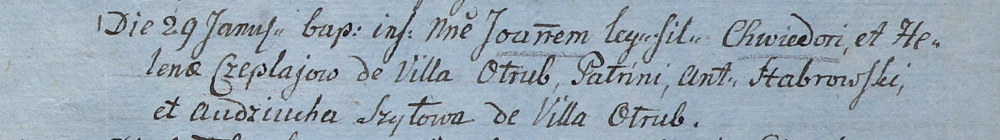

**Чапляй Иоанн Хведоров (Czeplaj Joann)**

29 января 1805 г -- крещение (НИАБ 937-4-32, лист 11, №5/1805-р).

**НИАБ 937-4-32:** Лист 11. **Метрическая запись №5/1805-р.**

Дедиловичский костел Наисвятейшего Сердца Иисуса. 29 января 1805 года.
Метрическая запись о крещении.

Czeplaj Joann -- сын родителей с деревни Отруб.

Czeplaj Chwiedor -- отец.

Czeplaiowa Helena -- мать.

Stabrowski Antoni -- крестный отец.

Szyłowa Audziucha -- крестная мать, с деревни Отруб.

Linhart Hiacinthus -- ксёндз.
