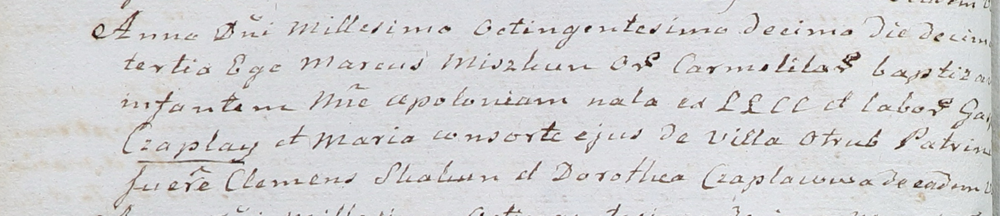

**Чапляй Доротея (Czaplaiowa Dorothea)**

13 февраля 1810 г -- крестная мать Аполонии, дочери Гаспера и Марии
Чапляев с деревни Отруб (НИАБ 937-4-32, лист 21об, №9/1810-р).

**НИАБ 937-4-32:** Лист 21об. **Метрическая запись №9/1810-р.**

Дедиловичский костел Наисвятейшего Сердца Иисуса. 13 февраля 1810 года.
Метрическая запись о крещении.

Czaplaiowna Apołonia -- дочь крестьян с деревни Отруб.

Czaplay Gasper -- отец.

Czaplaiowa Maria -- мать.

Skakun Clemens -- крестный отец.

Czaplaiowa Dorothea -- крестная мать, с деревни Отруб.

Miszkun Marcus -- ксёндз, с кармелитского монастыря.
