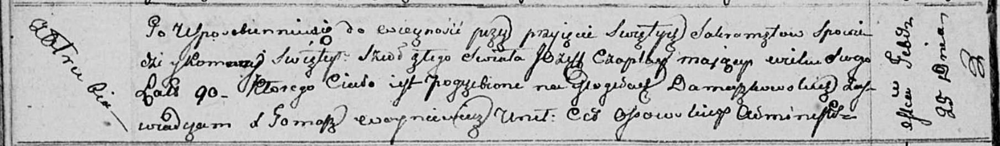

**Чапляй Иосиф (Czaplay Jozef)**

25 февраля 1811 г -- отпевание, прожил около 90 лет (родился около 1721
г) (НИАБ 136-13-919, лист 22об, №9/1811-у (ориг)).

**НИАБ 136-13-919:** Лист 22об. **Метрическая запись №9/1811-у (ориг).**

Осовская униатская церковь. 25 февраля 1811 года. Метрическая запись об
отпевании.

Czaplay Jozef -- умерший, 90 лет, с деревни Отруб, похоронен на кладбище
деревни Домашковичи.

Woyniewicz Tomasz -- ксёндз.
