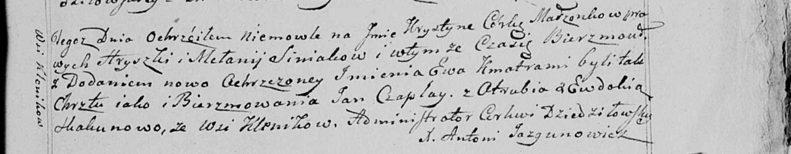
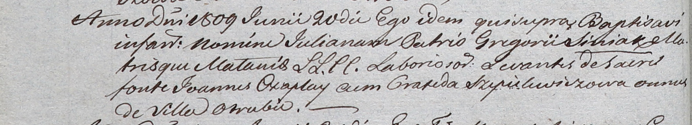

**Чапляй Ян (Czaplay Jan)**

20 августа 1799 г -- крестный отец Крыстыны Евы, дочери Синяков Грышки и
Мелании с деревни Клинники (НИАБ 136-13-938, лист 243, №32/1799-р
(коп)).

20 июня 1809 г -- крестный отец Юльяны, дочери Синяков Грыгора и Мелании
с деревни Отруб (НИАБ 937-4-32, лист 19об, №17/1809-р).

**НИАБ 136-13-938:** Лист 243. **Метрическая запись №32/1799-р (коп).**

(См. тж. НИАБ 136-13-894, лист 39об, №34/1799-р (ориг); РГИА 823-2-18,
лист 271, №33/1799-р (коп))

Дедиловичская Покровская церковь. 20 августа 1799 года. Метрическая
запись о крещении.

Siniakowna Krystyna Ewa -- дочь родителей с деревни Клинники.

Siniak Hryszka -- отец.

Siniakowa Mełanija -- мать.

Czaplay Jan -- кум, с деревни Отруб.

Skakunowa Ewdokia - кума, с деревни Клинники.

Jazgunowicz Antoni -- ксёндз.

**НИАБ 937-4-32:** Лист 19об. **Метрическая запись №17/1809-р.**

Дедиловичский костел Наисвятейшего Сердца Иисуса. 20 июня 1809 года.
Метрическая запись о крещении.

Siniakowna Juliana -- дочь крестьян с деревни Отруб.

Siniak Gregori -- отец.

Siniakowa Małania -- мать.

Czaplay Joann -- крестный отец, с деревни Отруб.

Szepielewiczowa Praxeda -- крестная мать, с деревни Отруб.

Miszkun Marcus -- ксёндз.
