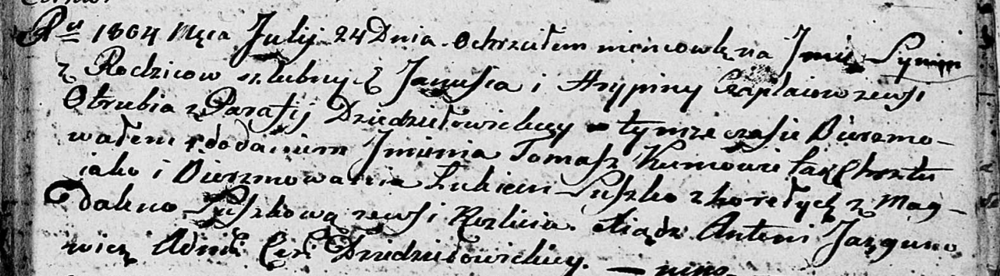

**Чапляй Грыпина (Czaplaiowa Hrypina)**

7 апреля 1803 г -- крещение сына Базыля Антона (НИАБ 136-13-894, лист
50, №12/1803-р (ориг)).

24 июля 1804 г -- крещение сына Сымона Фомы (НИАБ 136-13-894, лист 50,
№12/1803-р (ориг)).

**НИАБ 136-13-894:** Лист 50. **Метрическая запись №12/1803-р (ориг).**

Дедиловичская Покровская церковь. 7 апреля 1803 года. Метрическая запись
о крещении.

Czaplay Bazyli Antoni -- сын родителей с деревни Отруб.

Czaplay Jan -- отец.

Czaplaiowa Hrypina -- мать.

Suszko Łukjan -- кум, с деревни Горелое.

Suszkowa Magdalena -- кума, с деревни Отруб.

Jazgunowicz Antoni -- ксёндз.

**НИАБ 136-13-894:** Лист 54. **Метрическая запись №25/1804-р (ориг).**

Дедиловичская Покровская церковь. 24 июля 1804 года. Метрическая запись
о крещении.

Czaplay Symon Tomasz -- сын родителей с деревни Отруб.

Czaplay Januś -- отец.

Czaplaiowa Hrypina -- мать.

Suszko Łukian -- кум, с деревни Горелое.

Suszkowa Magdalena -- кума, с деревни Разлитье.

Jazgunowicz Antoni -- ксёндз.
