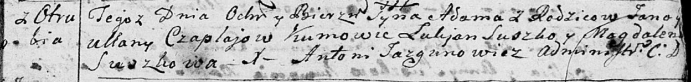

**Чапляй Адам Янов (Czaplay Adam)**

8 января 1793 г -- крещение (НИАБ 136-13-894, лист 18, №4/1793-р
(ориг)).

**НИАБ 136-13-894:** Лист 18. **Метрическая запись №4/1793-р (ориг).**

{width="6.496527777777778in"
height="0.7811384514435695in"}

Дедиловичская Покровская церковь. 8 января 1793 года. Метрическая запись
о крещении.

Czaplay Adam -- сын родителей с деревни Отруб.

Czaplay Jan -- отец.

Czaplajowa Ullana -- мать.

Suszko Łukjan -- кум.

Suszkowa Magdalena -- кума.

Jazgunowicz Antoni -- ксёндз.
