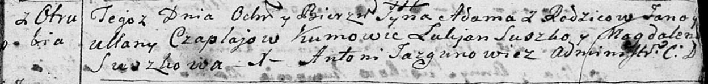
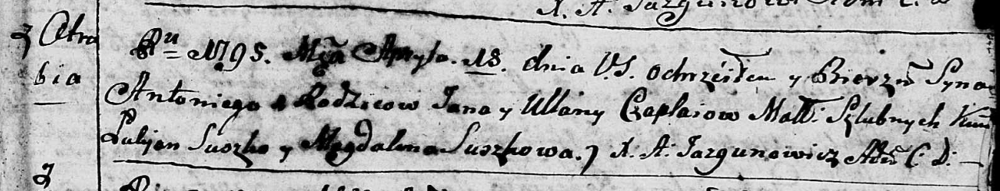
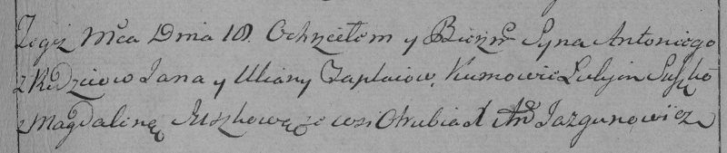
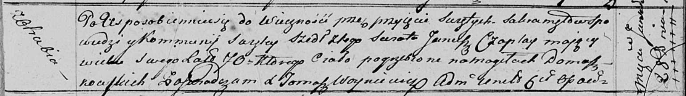

**Чапляй Ян (Czaplay Jan)**

8 января 1793 г -- крещение сына Адама (НИАБ 136-13-894, лист 18,
№4/1793-р (ориг)).

18 апреля 1795 г -- крещение сына Антона (НИАБ 136-13-894, лист 24,
№7/1795-р (ориг)), (РГИА 823-2-18, лист 252, №7/1795-р (коп)).

28 января 1817 г -- отпевание, умер в возрасте 70 лет (родился около
1747 г) (НИАБ 136-13-919, лист 30, №2/1817-у (ориг)).

**НИАБ 136-13-894:** Лист 18. **Метрическая запись №4/1793-р (ориг).**

Дедиловичская Покровская церковь. 8 января 1793 года. Метрическая запись
о крещении.

Czaplay Adam -- сын родителей с деревни Отруб.

Czaplay Jan -- отец.

Czaplajowa Ullana -- мать.

Suszko Łukjan -- кум.

Suszkowa Magdalena -- кума.

Jazgunowicz Antoni -- ксёндз.

**НИАБ 136-13-894:** Лист 24. **Метрическая запись №7/1795-р (ориг).**

Дедиловичская Покровская церковь. 18 апреля 1795 года. Метрическая
запись о крещении.

Czaplay Antoni -- сын родителей с деревни Отруб.

Czaplay Jan -- отец.

Czaplaiowa Ullana -- мать.

Suszko Łukjan - кум.

Suszkowa Magdalena - кума.

Jazgunowicz Antoni -- ксёндз.

**РГИА 823-2-18:** Лист 252. **Метрическая запись №7/1795-р (коп).**

Дедиловичская Покровская церковь. 10 апреля 1795 года. Метрическая
запись о крещении.

Czaplay Antoni -- сын родителей с деревни Отруб.

Czaplay Jan -- отец.

Czaplajowa Uliana -- мать.

Suszko Łukjan -- кум.

Suszkowa Magdalena -- кума.

Jazgunowicz Antoni -- ксёндз.

**НИАБ 136-13-919:** Лист 30. **Метрическая запись №2/1817-у (ориг).**

Осовская униатская церковь. 28 января 1817 года. Метрическая запись об
отпевании.

Czaplay Janusz -- умерший, 70 лет, с деревни Отруб, похоронен на
кладбище деревни Домашковичи.

Woyniewicz Tomasz -- ксёндз.
