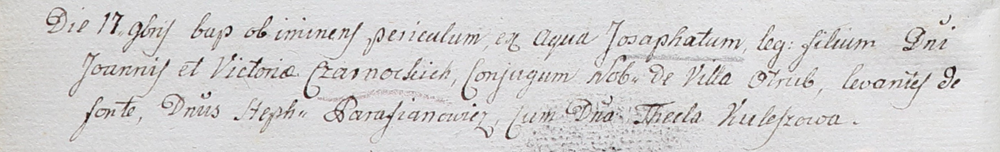

**Чарноцкий Иозафат Иоаннов (Czarnocki Josaphat)**

17 ноября 1802 г -- крещение (НИАБ 937-4-32, лист 7об, №36/1802-р).

**НИАБ 937-4-32:** Лист 7об. **Метрическая запись №36/1802-р.**

Дедиловичский костел Наисвятейшего Сердца Иисуса. 17 ноября 1802 года.
Метрическая запись о крещении.

Czarnocki Josaphat -- сын шляхтичей с деревни Отруб.

Czarnocki Joann -- отец.

Czarnocka Victoria -- мать.

Parafianowicz Stephan -- крестный отец, шляхтич.

Kuleszowa Thecla -- крестная мать, шляхтянка.

Linhart Hyacinthus -- ксёндз.
