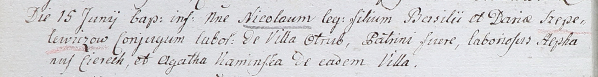

**Шапялевич Василь (Szapialewicz, Szepelewicz Wasil, Basili)**

15 июня 1802 г -- крещение сына Миколая (НИАБ 937-4-32, лист 6об,
№14/1802-р).

17 ноября 1804 г -- крещение дочери Тересы Барбары (НИАБ 136-13-894,
лист 55об, №54/1804-р (ориг)).

**НИАБ 937-4-32:** Лист 6об. **Метрическая запись №14/1802-р.**

Дедиловичский костел Наисвятейшего Сердца Иисуса. 15 июня 1802 года.
Метрическая запись о крещении.

Szepelewicz Mikołay -- сын крестьян с деревни Отруб.

Szepelewicz Basili -- отец.

Szepelewiczowa Daria -- мать.

Cierech Stephan -- крестный отец, крестьянин, с деревни Отруб.

Kaminska Agatha -- крестная мать, крестьянин, с деревни Отруб.

Linhart Hyacinthus -- ксёндз.

**НИАБ 136-13-894:** Лист 55об. **Метрическая запись №54/1804-р
(ориг).**

Дедиловичская Покровская церковь. 17 ноября 1804 года. Метрическая
запись о крещении.

Szapielewiczowna Teresa Barbara -- дочь родителей с деревни Отруб.

Szapielewicz Wasil -- отец.

Szapielewiczowa Daryia -- мать.

Hapanowicz Jozef -- кум.

Czaplaiowa Elena -- кума.

Jazgunowicz Antoni -- ксёндз.
