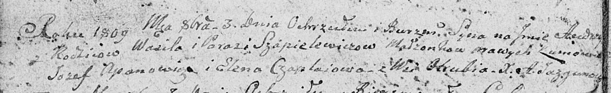

**Шапялевич Текля Василева (Szapialewiczowna Tekla)**

9 июля 1811 г -- крещение (НИАБ 136-13-894, лист 81, №33/1811-р (ориг)).

**НИАБ 136-13-894:** Лист 75об. **Метрическая запись №49/1809-р
(ориг).**

{width="6.496527777777778in"
height="0.9957010061242345in"}

Дедиловичская Покровская церковь. 3 октября 1809 года. Метрическая
запись о крещении.

Szapielewicz Audzey -- сын родителей с деревни Отруб.

Szapielewicz Wasil -- отец.

Szapielewiczowa Parasia -- мать.

Apanowicz Jozef -- кум.

Czaplaiowa Elena -- кума.

Jazgunowicz Antoni -- ксёндз.
