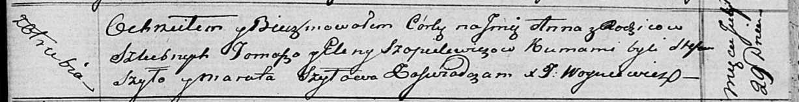
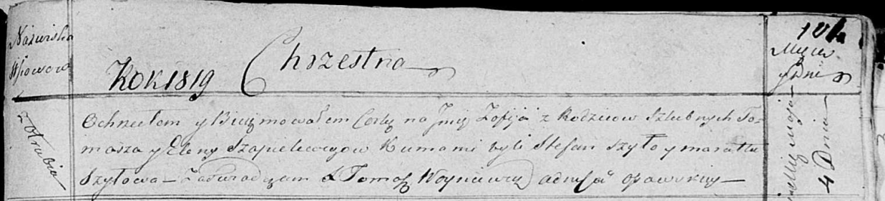
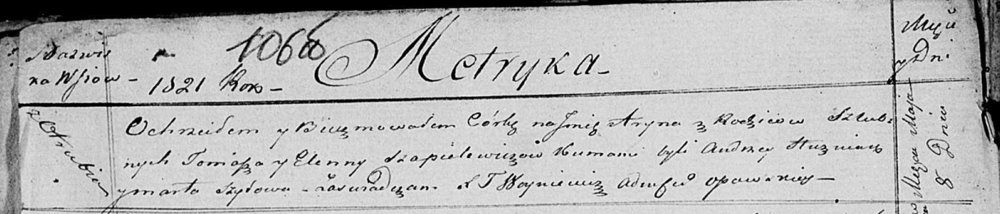

**Шапялевич Елена (Szopielewiczowa, Szapielewiczowa Elena)**

29 июля 1816 г -- крещение дочери Анны (НИАБ 136-13-894, лист 94,
№20/1816-р (ориг)).

4 мая 1819 г -- крещение дочери Софии (НИАБ 136-13-894, лист 101,
№23/1819-р (ориг)).

8 мая 1821 г -- крещение дочери Арыны (НИАБ 136-13-894, лист 106об,
№23/1821-р (ориг)).

**НИАБ 136-13-894:** Лист 94. **Метрическая запись №20/1816-р (ориг).**

Осовская Покровская церковь. 29 июля 1816 года. Метрическая запись о
крещении.

Szopielewiczowna Anna -- дочь родителей с деревни Отруб.

Szopielewicz Tomasz -- отец.

Szopielewiczowa Elena -- мать.

Szyło Stefan -- кум.

Szyłowa Maruta -- кума.

Woyniewicz Tomasz -- ксёндз.

**НИАБ 136-13-894:** Лист 101. **Метрическая запись №23/1819-р (ориг).**

Осовская Покровская церковь. 4 мая 1819 года. Метрическая запись о
крещении.

Szapielewiczowna Zofija -- дочь родителей с деревни Отруб.

Szapielewicz Tomasz -- отец.

Szapielewiczowa Elena -- мать.

Szyło Stefan -- кум.

Szyłowa Maruta -- кума.

Woyniewicz Tomasz -- ксёндз.

**НИАБ 136-13-894:** Лист 106об. **Метрическая запись №23/1821-р
(ориг).**

Осовская Покровская церковь. 8 мая 1821 года. Метрическая запись о
крещении.

Szapielewiczowna Aryna -- дочь родителей с деревни Отруб.

Szapielewicz Tomasz -- отец.

Szapelewiczowa Elenna -- мать.

Huzniak Andrzey -- кум.

Szyłowa Marta -- кума.

Woyniewicz Tomasz -- ксёндз.
