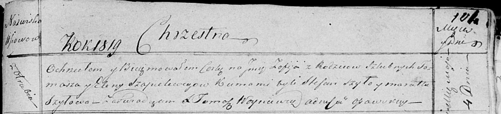

**Шапялевич София Томашова (Szapielewiczowna Zofija)**

4 мая 1819 г -- крещение (НИАБ 136-13-894, лист 101, №23/1819-р (ориг)).

**НИАБ 136-13-894:** Лист 101. **Метрическая запись №23/1819-р (ориг).**

Осовская Покровская церковь. 4 мая 1819 года. Метрическая запись о
крещении.

Szapielewiczowna Zofija -- дочь родителей с деревни Отруб.

Szapielewicz Tomasz -- отец.

Szapielewiczowa Elena -- мать.

Szyło Stefan -- кум.

Szyłowa Maruta -- кума.

Woyniewicz Tomasz -- ксёндз.
