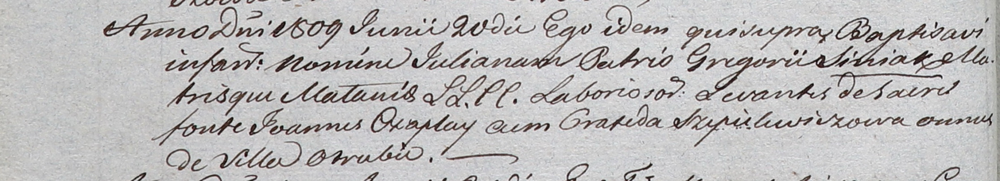

**Шапелевич Пракседа (Szepelewiczowa Praxeda)**

13 мая 1809 г -- крестная мать Антона, сына Дмитрия и Анны Синяков с
деревни Отруб (НИАБ 937-4-32, лист 19об, №16/1809-р).

20 июня 1809 г -- крестная мать Юльяны, дочери Синяков Грыгора и Мелании
с деревни Отруб (НИАБ 937-4-32, лист 19об, №17/1809-р).

**НИАБ 937-4-32:** Лист 19об. **Метрическая запись №16/1809-р.**

Дедиловичский костел Наисвятейшего Сердца Иисуса. 13 мая 1809 года.
Метрическая запись о крещении.

Siniak Antoni -- сын крестьян с деревни Отруб.

Siniak Dimitri -- отец.

Siniakowa Anna z Tresianków -- мать.

Czaplai Karp -- крестный отец, с деревни Отруб.

Szepelewiczowa Praxeda -- крестная мать, с деревни Отруб.

Miszkun Marcus -- ксёндз.

**НИАБ 937-4-32:** Лист 19об. **Метрическая запись №17/1809-р.**

Дедиловичский костел Наисвятейшего Сердца Иисуса. 20 июня 1809 года.
Метрическая запись о крещении.

Siniakowna Juliana -- дочь крестьян с деревни Отруб.

Siniak Gregori -- отец.

Siniakowa Małania -- мать.

Czaplay Joann -- крестный отец, с деревни Отруб.

Szepielewiczowa Praxeda -- крестная мать, с деревни Отруб.

Miszkun Marcus -- ксёндз.
