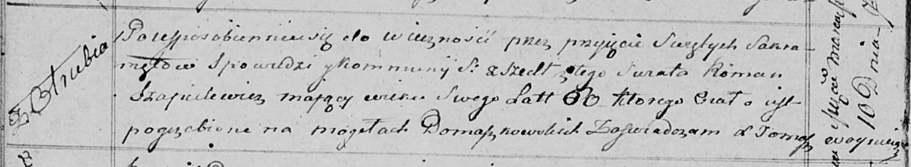

**Шапелевич Роман (Szapielewicz Roman)**

10 марта 1815 г -- отпевание, умер в возрасте 60 лет (родился около 1755
г) (НИАБ 136-13-919, лист 28об, №4/1815-у (ориг)).

**НИАБ 136-13-919:** Лист 28об. **Метрическая запись №4/1815-у (ориг).**

Осовская униатская церковь. 10 марта 1815 года. Метрическая запись об
отпевании.

Szapielewicz Roman -- умерший, 60 лет, с деревни Отруб, похоронен на
кладбище деревни Домашковичи.

Woyniewicz Tomasz -- ксёндз.
