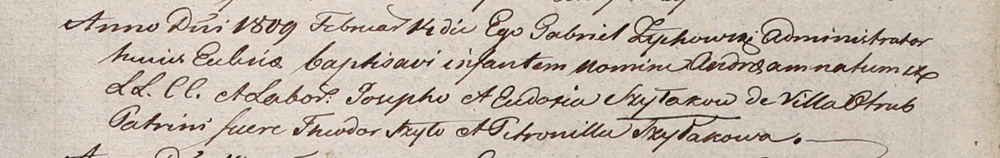
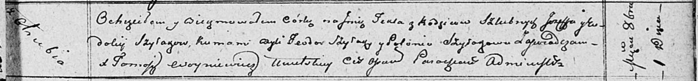

**Шилак Евдокия, Евдося (Szyłakowa Eudokija, Eudosia)**

14 февраля 1809 г -- крещение сына Андрея (НИАБ 937-4-32, лист 19,
№5/1809-р).

1 октября 1811 г -- крещение дочери Текли (НИАБ 136-13-894, лист 82,
№48/1811-р (ориг)).

**НИАБ 937-4-32:** Лист 19. **Метрическая запись №5/1809-р.**

Дедиловичский костел Наисвятейшего Сердца Иисуса. 14 февраля 1809 года.
Метрическая запись о крещении.

Szyłak Andrzei -- сын крестьян с деревни Отруб.

Szyłak Joseph -- отец.

Szyłakowa Eudosia -- мать.

Szyło Theodor -- крестный отец.

Szyłakowa Petronilla -- крестная мать.

Zychowski Gabriel -- ксёндз.

**НИАБ 136-13-894:** Лист 82. **Метрическая запись №48/1811-р (ориг).**

Осовская Покровская церковь. 1 октября 1811 года. Метрическая запись о
крещении.

Szyłakowna Tekla -- дочь родителей с деревни Отруб.

Szyłak Jozef -- отец.

Szyłakowa Eudokija -- мать.

Szyłak Teodor -- кум.

Szyłakowa Połonia -- кума.

Woyniewicz Tomasz -- ксёндз.
