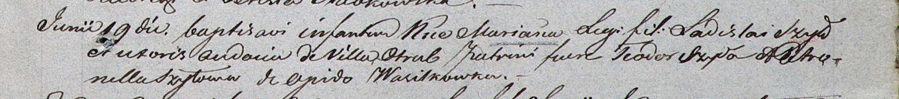

**Шило Авдоцыя (Szyłowa Audocia)**

19 июня 1804 г -- крещение дочери Марьяны (НИАБ 937-4-32, лист 10,
№13/1804-р).

**НИАБ 937-4-32:** Лист 10. **Метрическая запись №13/1804-р.**

Дедиловичский костел Наисвятейшего Сердца Иисуса. 19 июня 1804 года.
Метрическая запись о крещении.

Szyłowna Mariana -- дочь родителей с деревни Отруб.

Szyło Ładisław -- отец.

Szyłowa Audocia -- мать.

Szyło Teodor -- крестный отец.

Szyłowa Petronella -- крестная мать, с деревни Васильковка.

Galinowski Joann -- ксёндз, комендант Дедиловичского костела.
