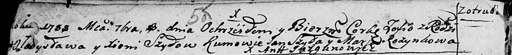

**Шило Зофья Владыславова (Szyłowna Zofia)**

8 сентября 1788 г -- крещение (НИАБ 136-13-894, лист 5об, №54/1788-р
(ориг)).

**НИАБ 136-13-894:** Лист 5об. **Метрическая запись №54/1788-р (ориг).**

Дедиловичская Покровская церковь. 8 сентября 1788 года. Метрическая
запись о крещении.

Szyłowna Zofia -- дочь родителей с деревни Отруб.

Szyło Władysław-- отец.

Szyłowa Xienia -- мать.

Szyło Jan - кум.

Rozynkowa Maria - кума.

Jazgunowicz Antoni -- ксёндз.
