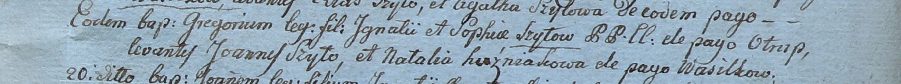

**Шило Грегор Игнатиев (Szyło Gregor)**

18 марта 1800 -- крещение (НИАБ 937-4-32, лист 1, №6/1800-р).

**НИАБ 937-4-32:** Лист 1. **Метрическая запись №6/1800-р.**

Дедиловичский костел Наисвятейшего Сердца Иисуса. 18 марта 1800 года.
Метрическая запись о крещении.

Szyło Gregor -- сын крестьян с деревни Отруб.

Szyło Jgnati -- отец.

Szyłowa Sophia -- мать.

Szyło Joann -- крестный отец.

Huzniakowa Natalia -- крестная мать, с деревни Васильковка.

Linhart Hyacinthus -- ксёндз.
