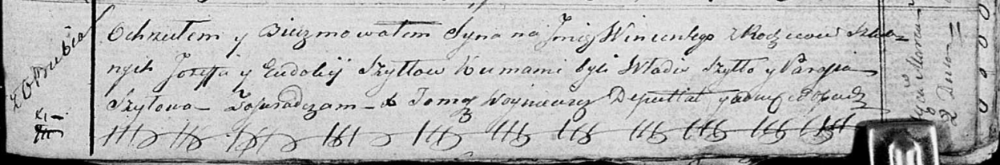

**Шило Винценты Иосифов (Szyło Wincenty)**

2 марта 1819 года -- крещение (НИАБ 136-13-894, лист 100, №9/1819-р
(ориг)).

**НИАБ 136-13-894:** Лист 100. **Метрическая запись №9/1819-р (ориг).**

Осовская Покровская церковь. 2 марта 1819 года. Метрическая запись о
крещении.

Szyło Wincenty -- сын родителей с деревни Отруб.

Szyło Jozef -- отец.

Szyłowa Eudokia -- мать.

Szyło Władis -- кум.

Szyłowa Parasia -- кума.

Woyniewicz Tomasz -- ксёндз.
