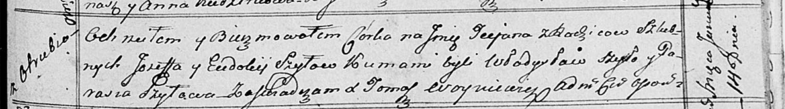
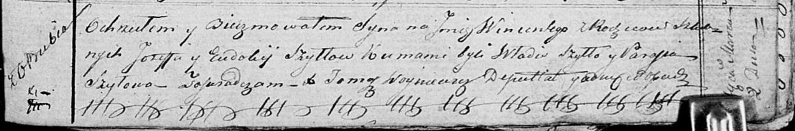

**Шило Евдокия (Szyłowa Eudokija)**

14 января 1817 года -- крещение дочери Татьяны (НИАБ 136-13-894, лист
95, №4/1817-р (ориг)).

2 марта 1819 года -- крещение сына Винцентыя (НИАБ 136-13-894, лист 100,
№9/1819-р (ориг)).

**НИАБ 136-13-894:** Лист 95. **Метрическая запись №4/1817-р (ориг).**

Осовская Покровская церковь. 14 января 1817 года. Метрическая запись о
крещении.

Szyłowna Tеciana -- дочь родителей с деревни Отруб.

Szyło Jozef -- отец.

Szyłowa Eudokija -- мать.

Szyło Władysław -- кум.

Szyłowa Parasia -- кума.

Woyniewicz Tomasz -- ксёндз.

**НИАБ 136-13-894:** Лист 100. **Метрическая запись №9/1819-р (ориг).**

Осовская Покровская церковь. 2 марта 1819 года. Метрическая запись о
крещении.

Szyło Wincenty -- сын родителей с деревни Отруб.

Szyło Jozef -- отец.

Szyłowa Eudokia -- мать.

Szyło Władis -- кум.

Szyłowa Parasia -- кума.

Woyniewicz Tomasz -- ксёндз.
