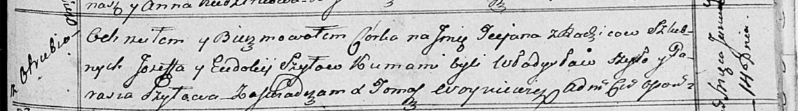

**Шило Иосиф (Szyło Jozef, Jozeph)**

10 ноября 1799 года -- свидетель венчания молодого Матея Апановича
девицей Марьяной Скакун (НИАБ 1781-27-199, лист 130, №13/1799-б).

28 июля 1808 г -- крестный отец Якуба, сына Петра и Марцеллы Карпичей с
деревни Отруб (НИАБ 937-4-32, лист 18об, №21/1808-р).

14 января 1817 года -- крещение дочери Татьяны (НИАБ 136-13-894, лист
95, №4/1817-р (ориг)).

2 марта 1819 года -- крещение сына Винцентыя (НИАБ 136-13-894, лист 100,
№9/1819-р (ориг)).

**НИАБ 1781-27-199:** Лист 130. **Метрическая запись №13/1799-б.**

{width="6.496527777777778in"
height="0.8340277777777778in"}

Дедиловичский костел Наисвятейшего Сердца Иисуса. 10 ноября 1799 года.
Метрическая запись о венчании.

Apanowicz Mathei -- жених, молодой, парохии Дедиловичской.

Skakunowa Mariana -- невеста, девица, парохии Дедиловичской.

Apanowicz Martin -- свидетель.

Szyło Jozeph -- свидетель, парохии Дедиловичской, с деревни Отруб.

Linhart Hyacinthus -- ксёндз.

**НИАБ 937-4-32:** Лист 18об. **Метрическая запись №21/1808-р.**

{width="6.496527777777778in"
height="1.0659722222222223in"}

Дедиловичский костел Наисвятейшего Сердца Иисуса. 28 июля 1808 года.
Метрическая запись о крещении.

Karpicz Jakub -- сын крестьян с деревни Отруб.

Karpicz Petro -- отец.

Karpiczowa Marcella -- мать.

Szyło Joseph -- крестный отец, с деревни Отруб.

Czaplaiowa Helena -- крестная мать, с деревни Отруб.

Scindzelewski Andreas -- ксёндз, комендант Дедиловичский.

**НИАБ 136-13-894:** Лист 95. **Метрическая запись №4/1817-р (ориг).**

{width="6.496527777777778in"
height="0.9031703849518811in"}

Осовская Покровская церковь. 14 января 1817 года. Метрическая запись о
крещении.

Szyłowna Tеciana -- дочь родителей с деревни Отруб.

Szyło Jozef -- отец.

Szyłowa Eudokija -- мать.

Szyło Władysław -- кум.

Szyłowa Parasia -- кума.

Woyniewicz Tomasz -- ксёндз.

**НИАБ 136-13-894:** Лист 100. **Метрическая запись №9/1819-р (ориг).**

{width="6.496527777777778in"
height="1.0775021872265966in"}

Осовская Покровская церковь. 2 марта 1819 года. Метрическая запись о
крещении.

Szyło Wincenty -- сын родителей с деревни Отруб.

Szyło Jozef -- отец.

Szyłowa Eudokia -- мать.

Szyło Władis -- кум.

Szyłowa Parasia -- кума.

Woyniewicz Tomasz -- ксёндз.
