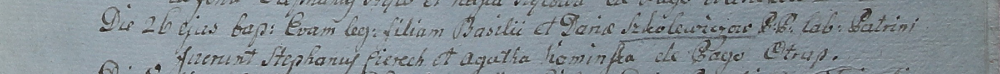

**Школевич Базыль (Szolewicz Basili)**

26 октября 1799 г -- крещение дочери Евы (НИАБ 1781-27-1994, лист 129,
№48/1799-р).

**НИАБ 1781-27-199:** Лист 129. **Метрическая запись №48/1799-р.**

{width="6.496527777777778in"
height="0.4840277777777778in"}

Дедиловичский костел Наисвятейшего Сердца Иисуса. 26 октября 1799 года.
Метрическая запись о крещении.

Szkolewiczowna Ewa -- дочь крестьян с деревни Отруб.

Szkolewicz Basili -- отец.

Szkolewiczowa Daria -- мать.

Cierech Stephanus -- крестный отец.

Kaminska Agatha -- крестная мать.

Linhart Hyacinthus -- ксёндз.
