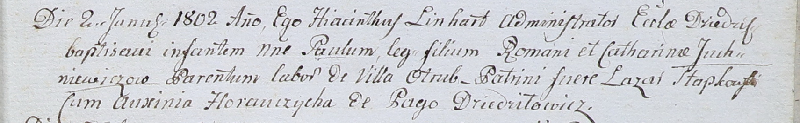

**Юхневич Роман (Juchniewicz Roman)**

2 января 1802 -- крещение сына Павла (НИАБ 937-4-32, лист 6, №1/1802-р).

**НИАБ 937-4-32:** Лист 6. **Метрическая запись №1/1802-р.**

Дедиловичский костел Наисвятейшего Сердца Иисуса. 2 января 1802 года.
Метрическая запись о крещении.

Juchniewicz Paul -- сын крестьян с деревни Отруб.

Juchniewicz Roman -- отец.

Juchniewiczowa Catharina -- мать.

Słapkowski Łazar -- крестный отец, с деревни Дедиловичи.

Horauchycha Auxinia -- крестная мать, с деревни Дедиловичи.

Linhart Hyacinthus -- ксёндз.
