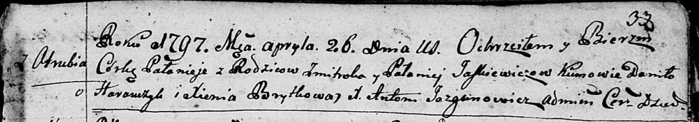

**Юшкевич Змитрок (Juszkiewicz Zmitrok)**

26 апреля 1797 -- крещение дочери Паланеи (НИАБ 136-13-894, лист 33,
№24/1797-р (ориг)).

**НИАБ 136-13-894:** Лист 33. **Метрическая запись №24/1797-р (ориг).**

Дедиловичская Покровская церковь. 26 апреля 1797 года. Метрическая
запись о крещении.

Juszkiewiczowna Pałanieja -- дочь родителей с деревни Отруб.

Juszkiewicz Zmitrok -- отец.

Juszkiewiczowa Pałanieja -- мать.

Harawczyk Daniło - кум.

Brytkowa Xienia - кума.

Jazgunowicz Antoni -- ксёндз.
