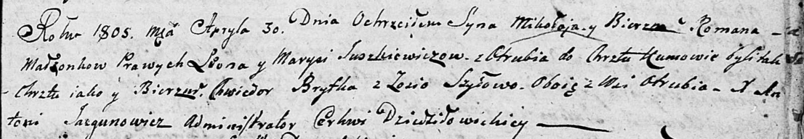

**Юшкевич Миколай Леонов (Juszkiewicz Mikołay Roman)**

30 апреля 1805 -- крещение (НИАБ 136-13-894, лист 57, №23/1805-р
(ориг)).

**НИАБ 136-13-894:** Лист 57. **Метрическая запись №23/1805-р (ориг).**

Дедиловичская Покровская церковь. 30 апреля 1805 года. Метрическая
запись о крещении.

Juszkiewicz Mikołay Roman -- сын родителей с деревни Отруб.

Juszkiewicz Leon -- отец.

Juszkiewiczowa Marysia -- мать.

Brytka Chwiedor -- кум, с деревни Отруб.

Szyłowa Zosia -- кума, с деревни Отруб.

Jazgunowicz Antoni -- ксёндз.
