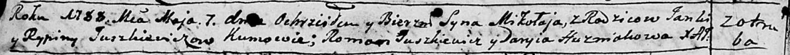
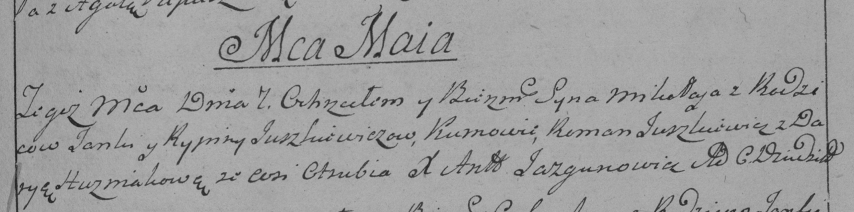

**Юшкевич Янка (Juszkiewicz Janka)**

7 мая 1788 -- крещение сына Миколая (НИАБ 136-13-894, лист 4об,
№30/1788-р (ориг)), (РГИА 823-2-18, лист 236, №14/1788-р (коп)).

**НИАБ 136-13-894:** Лист 4-об. **Метрическая запись №30/1788-р
(ориг).**

Дедиловичская Покровская церковь. 7 мая 1788 года. Метрическая запись о
крещении.

Juszkiewicz Mikołaj -- сын родителей с деревни Отруб.

Juszkiewicz Janka-- отец.

Juszkiewiczowa Rypina -- мать.

Juszkiewicz Roman - кум.

Huzniakowa Daryia - кума.

Jazgunowicz Antoniusz -- ксёндз.

**РГИА 823-2-18:** Лист 236. **Метрическая запись №14/1788-р (коп).**

Дедиловичская Покровская церковь. 7 мая 1788 года. Метрическая запись о
крещении.

Juszkiewicz Mikołay -- сын родителей с деревни Отруб.

Juszkiewicz Janka -- отец.

Juszkiewiczowa Rypina -- мать.

Juszkiewicz Roman -- кум.

Huzniakowa Darya - кума.

Jazgunowicz Antoni -- ксёндз.
