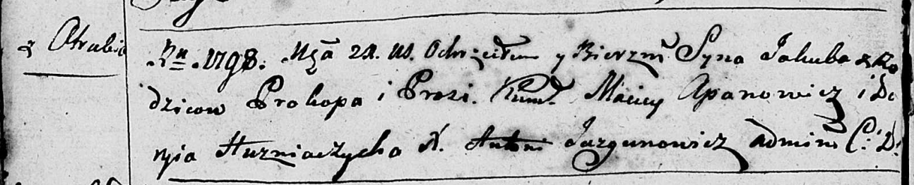
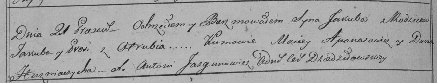

**Якуб Прокопов (Jakub)**

21 марта 1798 г -- крещение (НИАБ 136-13-894, лист 35об, №9/1798-р
(ориг)), (РГИА 823-2-18, лист 262об, №9/1798-р (коп)).

**НИАБ 136-13-894:** Лист 35-об. **Метрическая запись №9/1798-р
(ориг).**

Дедиловичская Покровская церковь. 21 марта 1798 года. Метрическая запись
о крещении.

Jakub -- сын родителей с деревни Отруб.

Prokop -- отец.

Prosia -- мать.

Apanowicz Maciey - кум.

Huzniaczycha Daryja - кума.

Jazgunowicz Antoni -- ксёндз.

**РГИА 823-2-18:** Лист 262об. **Метрическая запись №9/1798-р (коп).**

Дедиловичская Покровская церковь. 21 марта 1798 года. Метрическая запись
о крещении.

Jakub -- сын родителей с деревни Отруб.

Jakub -- отец.

Prosia -- мать.

Apanasowicz Maciey -- кум.

Huzniaczycha Daria -- кума.

Jazgunowicz Antoni -- ксёндз.
